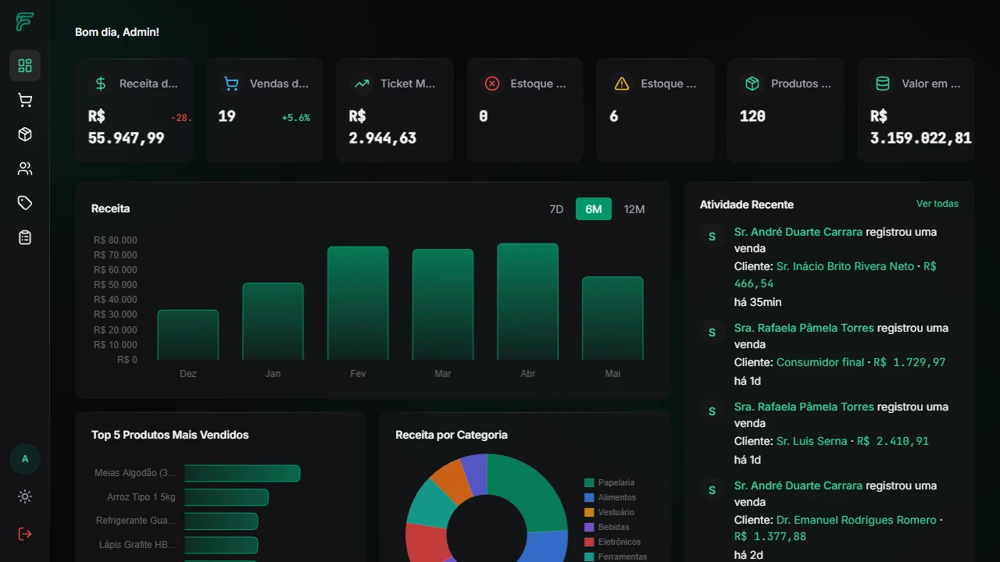
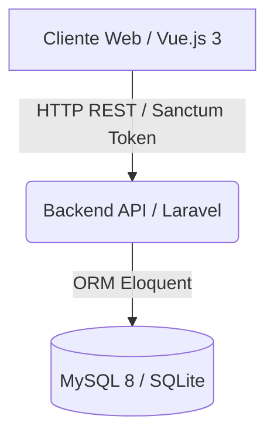
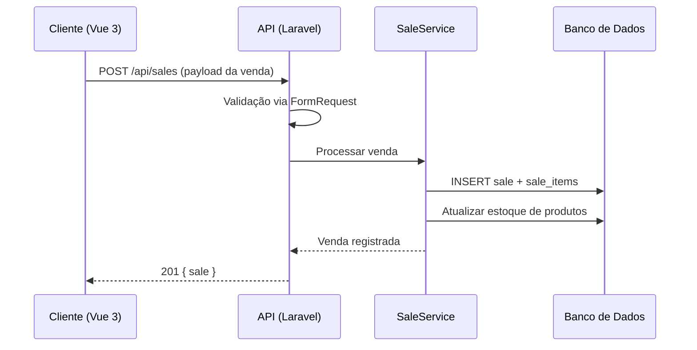

# FlowERP


      


## Visão geral

O FlowERP é um sistema de gestão empresarial moderno, rápido e escalável. A plataforma foi projetada como um monorepo, oferecendo uma solução robusta para controle de vendas, produtos e gestão operacional.

1. **Stack principal:** PHP, Laravel, Eloquent, MySQL/SQLite, Sanctum, Vue.js 3, Pinia e Tailwind CSS 4.
2. **Diferenciais:** Arquitetura orientada a serviços no backend, interface reativa e tipada no frontend (Composition API), e rotinas otimizadas para processamento de vendas.
3. **Repositório oficial:** [github.com/gabriellqv/flowerp](https://github.com/gabriellqv/flowerp)

## Preview

<div align="center">
  
  <p><em>Interface principal do sistema de gestão empresarial FlowERP.</em></p>
</div>

## Resultados e impacto

1. **Gestão centralizada:** Controle unificado de produtos, categorias e vendas em uma única interface responsiva.
2. **Alta performance:** O backend em Laravel 13 garante respostas rápidas através de consultas otimizadas e arquitetura limpa.
3. **Segurança por camadas:** A autenticação via Sanctum garante que apenas usuários autorizados (Admins, Gerentes) executem operações críticas.

## Arquitetura do sistema



### Fluxo de processamento de vendas



## Tecnologias

| Camada | Tecnologia |
|---|---|
| **Frontend** | Vue.js 3, TypeScript, Composition API, Tailwind CSS 4, Pinia, Vue Router |
| **Backend** | Laravel 13, PHP 8.3, Eloquent ORM |
| **Banco** | MySQL 8 / SQLite |
| **Autenticação** | Laravel Sanctum (Token SPA) |
| **Testes Backend** | Pest PHP |
| **Testes Frontend** | Vitest |
| **Linting Backend** | Laravel Pint |
| **Linting Frontend** | ESLint, Prettier |
| **DevOps** | Docker, Docker Compose, GitHub Actions (CI) |

## Funcionalidades

1. Autenticação via tokens Sanctum com restrição de rotas por perfis de acesso (Admin e Gerente).
2. Gestão de catálogo de produtos com controle de estoque e categorização.
3. Registro de vendas com processamento de itens múltiplos e cálculo automático de totais.
4. Dashboard gerencial para análise de resultados.
5. Arquitetura orientada a serviços (Services) isolando a lógica de negócio dos Controllers.

## Decisões técnicas

1. **Controllers magros:** Toda lógica de negócio (ex: cálculo de totais em vendas) reside nos Services.
2. **Form Requests dedicados:** A validação de entrada é isolada em classes FormRequest para garantir segurança dos dados.
3. **UUIDs como Chaves Primárias:** Utilização de UUIDs em todas as tabelas de domínio (exceto Users) para maior segurança e escalabilidade, gerados automaticamente via model events no Eloquent.
4. **Estado reativo tipado:** O estado da aplicação no frontend é mantido via Pinia com tipagem TypeScript completa.
5. **Formatação Padronizada:** Uso rigoroso de ferramentas como Laravel Pint e ESLint/Prettier no fluxo de CI e pre-commit para garantir o padrão de código estabelecido.

## Estrutura do projeto

```
flowerp/
  backend/               # API REST em Laravel 13
  frontend/              # SPA em Vue 3 + TypeScript
  docs/                  # Documentação adicional
  docker-compose.yml     # Orquestração de containers
  .github/workflows/     # Pipeline CI/CD
```

## Como executar

### Pré-requisitos

1. PHP 8.3+ e Composer.
2. Node.js 20+ e NPM.
3. Docker e utilitário Docker Compose (recomendado).

### Inicialização via Docker (Recomendado)

```bash
docker compose up --build -d
```

- Frontend: `http://localhost:3000`
- API: `http://localhost:8000`

### Desenvolvimento manual (sem Docker)

#### 1. Backend (Laravel)

```bash
cd backend
cp .env.example .env
composer install
php artisan key:generate
php artisan migrate:fresh --seed
php artisan serve
```
A API estará disponível em `http://localhost:8000`.

#### 2. Frontend (Vue.js)

```bash
cd frontend
npm install
npm run dev
```
A interface estará disponível em `http://localhost:3000`.

### Credenciais de teste

Após rodar as migrations com seed (`--seed`), você pode utilizar:

| Perfil | E-mail | Senha |
|---|---|---|
| Admin | `admin@flowerp.com` | `senha123` |
| Gerente | `gerente@flowerp.com` | `senha123` |

## Testes

```bash
# Backend (Pest PHP)
cd backend
php artisan test

# Frontend (Vitest)
cd frontend
npm run test
```

## Status do projeto

**✅ Projeto em Desenvolvimento Ativo**

A arquitetura base e os padrões de codificação (conforme convensões do projeto) estão estabelecidos. O desenvolvimento contínuo de novas funcionalidades (produtos, vendas) segue rigorosos critérios de qualidade (TSDoc, PHPDoc, Conventional Commits).
